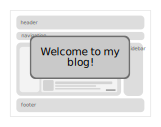

# Web Development Introduction - Assignment

## Setup

Please refer to the [setup](./SETUP.md) section.

## Assignments

### HTML

The goal of this HTML assignment is the creation of fictive blog homepage. Use
the existing HTML document, remove everything you don't need and start from
there.

You don't have to implement any page other than the blog start page.

The blog homepage should contain the following items:

* A list of blog post teasers.  
  Be creative and just invent a couple of topics or use lorem ipsum.
* Each teaser should consist of an image, a title, a short description and a
  link to a detail page (you don't have to implement a detail page!).
* The blog homepage needs a catchy headline.
* Add a navigation with navigation items that lead to other fictitious sections
  of the blog (don't build those pages).
* The blog homepage should have a footer that holds meta information for the
  blog.

For sample images you can use a service like <https://placeholder.com>:

```html

```


Sample texts can be created via <https://www.lipsum.com>.

__Always keep the semantics of your homepage in mind!  
HTML provides a lot of building blocks that you can use to properly define the
elements of your website.__

_Formatting and styling is not part of this assignment! Only concentrate on the
pure HTML based document structure._

### CSS

* Use CSS to style the blog homepage that you have created in the previous
  assignment.  
  Set `color`s, `font-size`s and `font-family`s to your liking and assign proper
  spacings to adjacent elements using `padding`s and `margin`s. Utilize
  `border`s and `background-color`s to offset elements from each other.  
  There are also a couple of interesting CSS features like `box-shadow`,
  `border-radius`, `text-shadow`, `border-image`, why not try some of these?

* Introduce a sidebar with some (fictitious) blog related content, for example
  the latest comments, most important tags for the blog, most read blog posts
  and so on.

* The sidebar should be positioned on the side of the list of blog posts

This sketch represents a possible structure of how your blog home page might
look like. This is not a specification but merely a mental model to help you
getting a better feel for a possible setup. 

__Bonus Assignment (if there's still time):__  
Create a floating notification that greets the visitor of your site:


### JavaScript & TypeScript

Create a class that handles time keeping in general.  
After instantiation it should be able to calculate the elapsed time since then.

_Hint: The function `Date.now()` provides you with the elapsed time in
milliseconds since the beginning of the UNIX epoch._

The class should implement the `Timekeeper` interface:

```ts
type timekeeperCallback = (elapsedTime: number) => void

interface Timekeeper {
    registerCallback: (callback: timekeeperCallback) => Timekeeper
    reset: () => void
}
```

Via the `registerCallback` method the `Timekeeper` instance should provide the
possibility to register a callback. That callback should be called every second,
transporting the elapsed time since the site has been opened.

Create a instance of this class whenever your blog homepage loads. Register a
handler that prints the elapsed time into the header of the blog homepage.

_Hint: you can use `setInterval` to periodically execute a piece of code._

Format the elapsed time in readable form (e.g. 1min 20s).

__Bonus Assignment (if there's still time):__  
Add a reset button that resets elapsed time (using the `reset` method from the
`Timekeeper` interface).
